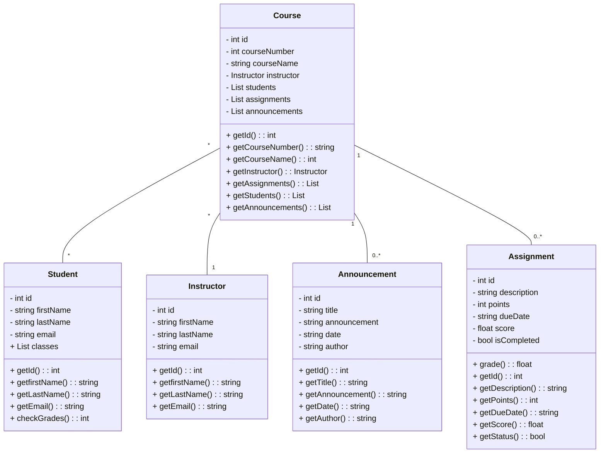

```mermaid
classDiagram
  Course "*" -- "*" Student
  Course "*" -- "1" Instructor
  Course "1" -- "0..*" Announcement
  Course "1" -- "0..*"  Assignment 
  
  class Course{
    - int id
    - int courseNumber
    - string courseName
    - Instructor instructor
    - List<Student> students
    - List<Assignment> assignments
    - List<Announcement> announcements
    
    + getId() : int
    + getCourseNumber() : string
    + getCourseName() : int
    + getInstructor() : Instructor
    + getAssignments() : List<Assignment>
    + getStudents() : List<Student>
    + getAnnouncements() : List<Announcement>
  }
  
  class Announcement{
    - int id
    - string title
    - string announcement
    - string date
    - string author
    
    + getId() : int
    + getTitle() : string
    + getAnnouncement() : string
    + getDate() : string
    + getAuthor() : string
  }
  
  class Student{
    - int id
    - string firstName
    - string lastName
    - string email
    + List<Course> classes
    
    + getId() : int
    + getfirstName() : string
    + getLastName() : string
    + getEmail() : string
    + checkGrades() : int
  }
  
  class Instructor{
    - int id
    - string firstName
    - string lastName
    - string email
    
    + getId() : int
    + getfirstName() : string
    + getLastName() : string
    + getEmail() : string
  }
  
  class Assignment{
    - int id
    - string description
    - int points
    - string dueDate
    - float score
    - bool isCompleted
    
    + grade() : float
    + getId() : int
    + getDescription() : string
    + getPoints() : int
    + getDueDate() : string
    + getScore() : float
    + getStatus() : bool
  } 

```